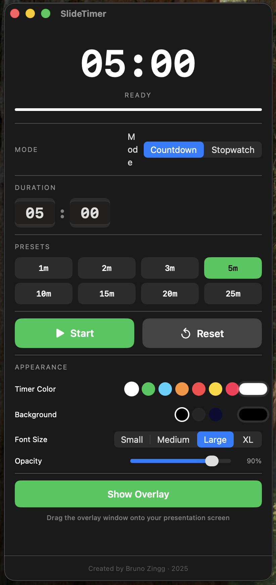
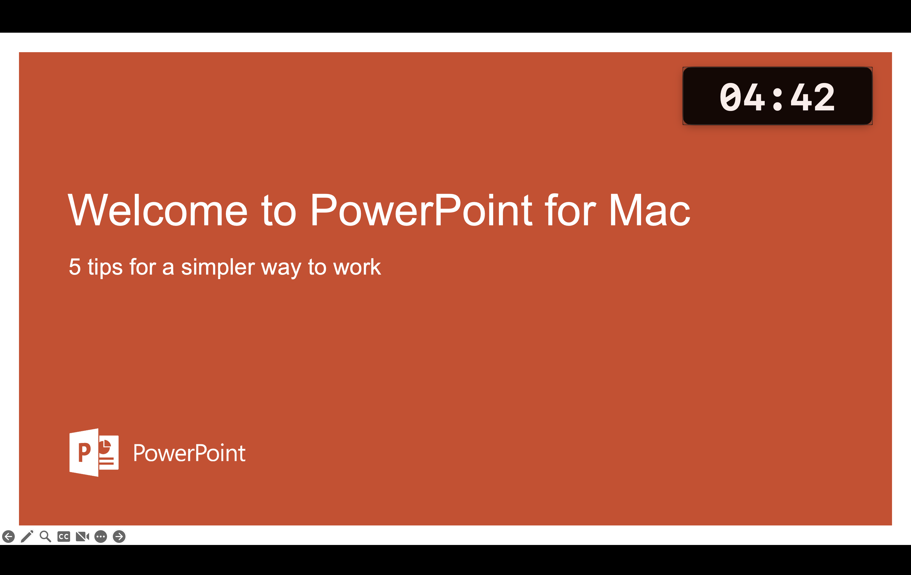

# SlideTimer

A simple yet powerful timer overlay for presentations.

SlideTimer is a macOS application that displays a timer overlay on your screen, which is always visible, even when you are in a fullscreen presentation. This is perfect for keeping track of your presentation time without having to look at your watch or phone.

## Features

-   **Countdown and Stopwatch modes:** Use the timer as a countdown or a stopwatch.
-   **Customizable appearance:** Change the color of the timer, the background color, the font size, and the opacity of the overlay.
-   **Always on top:** The timer overlay stays on top of all other windows, including fullscreen presentations.
-   **Preset timers:** Quickly set the timer for common presentation lengths.
-   **Sound notification:** Get an audible notification when the timer finishes.
-   **Keyboard shortcuts:** Control the timer with keyboard shortcuts.

## Screenshots

**Main UI**



**Timer in Presentation**



## How to Build

To build the application, you need Xcode installed on your Mac.

1.  Clone the repository.
2.  Open a terminal in the project's root directory.
3.  Run the following command to build the application:

    ```bash
    xcodebuild -scheme SlideTimer -configuration Release clean build
    ```

4.  The application bundle (`SlideTimer.app`) will be located in the `~/Library/Developer/Xcode/DerivedData/SlideTimer-*/Build/Products/Release/` directory.

## Technologies Used

-   **SwiftUI:** The user interface is built with SwiftUI.
-   **Combine:** The Combine framework is used for reactive programming, especially for the timer logic.
-   **AppKit:** The app uses AppKit to create and manage the overlay window (`NSPanel`).

## Credits

Created by Bruno Zingg · 2026
